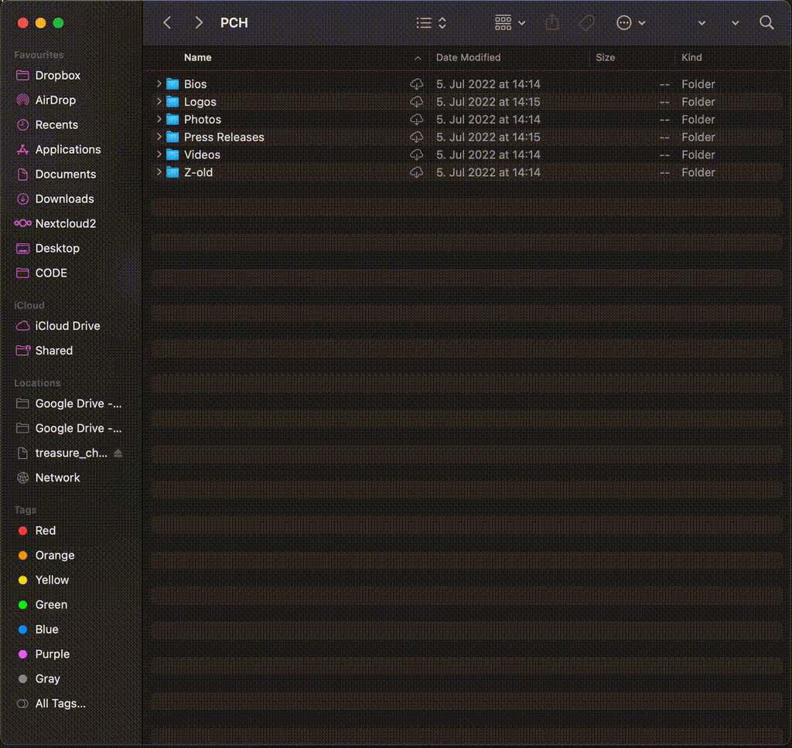

# GDrive Finder Service

<p align="center"></p>

GDrive Finder Service is a Finder extension for MacOS that allows you to share Google Drive links inside of your Google Workspace that open locally in your Finder.

This is super useful when your company uses Google Drive for internal file hosting. Instead of sharing browser links to files or folders you can generate links that you can share on Slack, Teams etc. which, when clicked on, will navigate to the file locally in the user's Finder.




[](https://github.com/pch-innovations/gdrive-finder-service/releases)

[](https://github.com/pch-innovations)
[](https://www.linkedin.com/company/pch-innovations-gmbh)
[](https://www.instagram.com/pch.innovations/)

# Getting started
## Prerequisites
- Using MacOS Google Drive desktop client

## Installation

1. Download the latest [release](https://github.com/pch-innovations/gdrive-finder-service/releases) `google-drive-finder.pkg`
2. Right click -> Open (not signed)
3. Follow installer instructions

## Usage

### Sharing a link

1. Navigate to a shared google drive folder or file in your Finder
2. Right-click -> Services -> Copy GDrive link
    - This will copy the link to your clipboard
    - Sometimes its not under "Services" but directly in the menu
3. Share the link with your coworkers (e.g. on Slack)

### Opening a link

1. Just click on a "gdrive://" link you shared or have received
    - Tell Slack the first time to always open gdrive links with the app
2. Your Finder will navigate to the shared file if it can access it on your computer


---
# Development
## What does this do

At its current stage it:

- Adds the context menu item `Copy GDrive link` to your Finder
    - This copies a modified path to your clipboard that looks like `gdrive://CloudStorage/GDrive-yourgoogleacount/yourfile`
- Handles the app url scheme `gdrive://` to open links generated by this service
    - The service will turn the link back to a local path, based on the domain of your google account.
    - It then highlights the file in a new Finder window

This basically allows you to share local GDrive links with your coworkers who have access to the same shared files.

## Building it from source

1. Build in Xcode
2. Archive .app and put in `/Applications` folder

## Testing / Debugging

- To test just run the project from Xcode and watch the console while opening or generating links
- If you want to refresh the Finder services context menu run
 ```sh
 /System/Library/Frameworks/CoreServices.framework/Frameworks/LaunchServices.framework/Support/lsregister -kill -r -domain local -domain system -domain user
 ```

## Creating installer

1. In Xcode go to Product > Archive > Distribute App > Copy App
2. Archive the app under the name `gdrive-finder-service` at `./Installer/`
3. Run `./Installer/create_packge`
    - This will package whatever .app bundle is at `./Installer/gdrive-finder-service/gdrive-finder-service.app`
    - Additionally it bundles the `Installer/scripts/postinstall`
4. Find the installer package at `Installer/output/gdrive-finder-service.pgk`


## Further info

- Everything interesting happens in `gdrive-share/AppDelegate.swift`
- `func application(...)` is the entry point for clicking on a `gdrive://` link
- `func handleFileService(...)` is the entry point for clicking on the `Copy GDrive link` context menu item
    - Configured in `gdrive-share/Info.plist`
- `func applicationDidFinishLaunching(...)` sets up an auto-terminate after 5 seconds to close the app automatically when it has been opened by the postinstall script
    - The postinstall script opens the app once to register the service items with MacOS
    
## Known issues / TODOS

- [ ] google drive mount point sometimes different on a single user installation (/Volumes/GoogleDrive vs /Volumes/CloudStorage-gdrivesuer)
